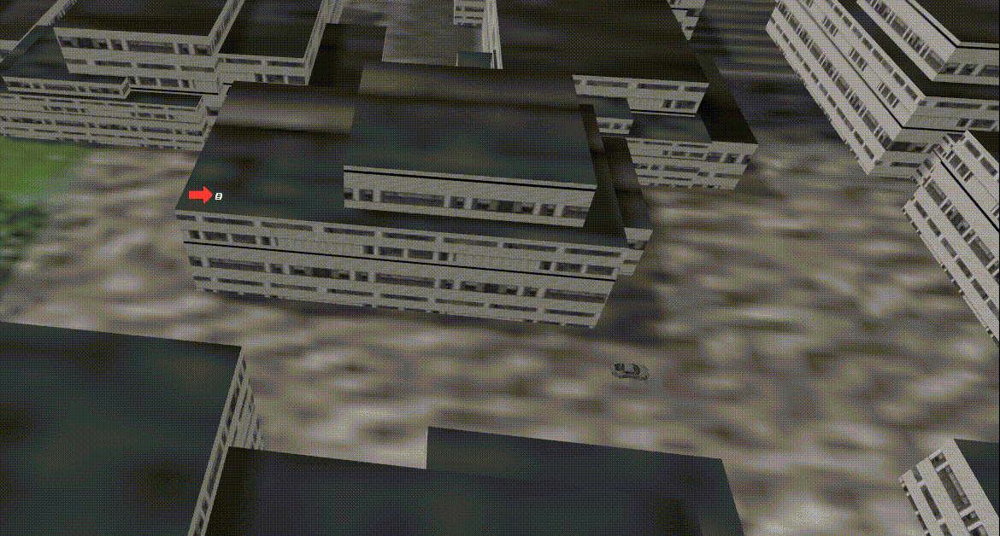
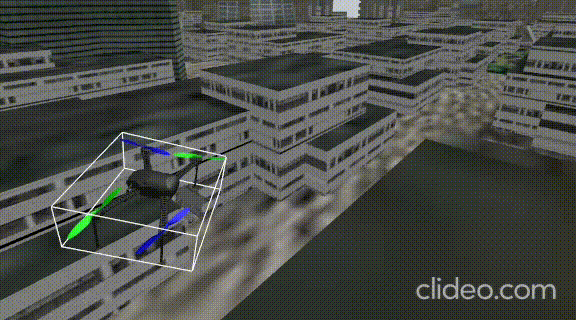

## Car tracking

## Hovering in wind 

### Setup:

Firstly, we clone repos (takes long time):

```bash
cd ws/src
vcs import --recursive < ros2_gz.repos
cd ..
```

We set up the environment:
```bash
ROS_VERSION=2
ROS_PYTHON_VERSION=3
ROS_DISTRO=humble
```

Install dependencies:

``` bash
source /opt/ros/${ROS_DISTRO}/setup.bash
sudo apt update
rosdep update
rosdep install --rosdistro ${ROS_DISTRO} --from-paths src --ignore-src -y
```

Now we get micro-xrce-dds-gen (Solution from this PR:
https://github.com/ArduPilot/ardupilot/pull/29850/files):


Before that:

(make sure you have gradle version 7.6 and java version 17.11, not strict requirment but useful if build failed, you may try first without fixing versions)

### Check versions:

```bash
gradle -v
java -version
```

### Change versions (in case of multiple java installations):

To change the version:
```bash
sudo update-alternatives --config java
```
To get another version:
```bash
sudo apt install openjdk-17-jdk -y
```

Now let's get into setting up micro-xrce-dds-gen:
```bash
git clone --recurse-submodules --branch v4.7.0 https://github.com/ardupilot/Micro-XRCE-DDS-Gen.git
cd Micro-XRCE-DDS-Gen
./gradlew assemble
export PATH=$PATH:$(pwd)/scripts
```

Before running the build command refer to issue 1 in known errors section, you may need a fix based on your current setup.

In the same terminal:
From the ws folder run:
(make sure you have in this terminal the Micro-XRCE-DDS-Gen path set using the export command mentioned above)
```bash
colcon build --symlink-install  --packages-skip ardupilot_dds_tests --cmake-args   -DBUILD_TESTING=OFF   -DCMAKE_BUILD_TYPE=RelWithDebInfo   -DUAGENT_USE_SYSTEM_FASTDDS=OFF   -DUAGENT_USE_SYSTEM_FASTCDR=OFF -DUAGENT_USE_SYSTEM_LOGGER=ON   -DCMAKE_PREFIX_PATH=/opt/ros/humble --event-handlers console_cohesion+ desktop_notification-
```

If faced errors, check known errors section.


Before running, download the environment folder (osm_environment) from:
https://1drv.ms/f/c/ba4a36e37e136c1e/Elg7LCq3lyVAlq7tJH8TJ98BAybyg3v5VP2ceN41ZzSV-A?e=1YZqYd

and place it in your gazebo models resources folder.

To know it, use:
```bash
echo $GZ_SIM_RESOURCE_PATH
```

Now, Run:
```bash
source ./src/ardu_gz_ws/install/setup.bash
```

### Running
Launch ardupilot_gz_bringup
```bash
ros2 launch ardupilot_gz_bringup run_with_ns.launch.py ns:=/uav1
```

Start MAVProxy
```bash
mavproxy.py --master=udp:127.0.0.1:14550 --out=udp:127.0.0.1:14553 --console --map
```

To start a waypoint mission In the same terminal you can run
```bash
wp load ./src/ardupilot/Tools/autotest/Generic_Missions/CMAC-circuit.txt
mode auto
arm throttle
```


If you want to start the follow mission:

From the root workspace:

``` bash
colcon build --packages-select track_controller common_msgs
source install/setup.bash
```

also source the simulation environment as the track_controller depends on ardupilot_msgs.

Then run in the mavproxy terminal(check in the mavconsole if each one is accepted, simulation may need time to settle before arming):
```bash
mode guided
arm throttle
takeoff 10
```

Finally, run:
```bash
ros2 run track_controller track_controller
```

In another terminal:

``` bash
ros2 action send_goal --feedback track common_msgs/action/Track 'required_alt: 25.0
required_dist: 10.0'
```


Known Issues:


1- Target already defined eProsima

Or everython builds but you don't get /ap topics when running ros2 topic list

* This means you have multiple fastrtps, fastcdr, fastdds in your machine
* use: 
```bash
sudo find /usr/local -iname "*fastdds*" -o -iname "*fastrtps*" -o -iname "*fastcdr*"
```
It shouldn't give any output
* delete each one of them (fast-rtps, fast-dds, fast-cdr, agent)
```bash
sudo rm -rf /usr/local/include/fastrtps \
             /usr/local/include/fastdds \
             /usr/local/include/fastcdr \
             /usr/local/lib/libfastrtps* \
             /usr/local/lib/libfastdds* \
             /usr/local/lib/libfastcdr* \
             /usr/local/share/fastrtps* \
             /usr/local/share/fastdds* \
             /usr/local/share/fastcdr* \
             /usr/local/fastdds* \
             /usr/local/lib/cmake/fastcdr \
             /usr/local/include/uxr/agent 
```
# The following command shouldn't give any output, if it gave then there are traces
```bash
sudo find /usr/local -iname "*fastdds*" -o -iname "*fastrtps*" -o -iname "*fastcdr*"
```
Then we build everything ourselves (doesn't take time and smooth):
```bash
git clone -b v1.1.0 https://github.com/eProsima/Fast-CDR.git
cd Fast-CDR
mkdir build && cd build
cmake ..
make -j$(nproc)
sudo make install
```

```bash
git clone -b v2.14.1 https://github.com/eProsima/Fast-DDS.git
cd Fast-DDS
mkdir build && cd build
cmake ..
make -j$(nproc)
sudo make install
```

Now build micro ros agent from the source usinf installed fastdds and fastcdr:
```bash
git clone -b v2.4.2 https://github.com/eProsima/Micro-XRCE-DDS-Agent.git
cd Micro-XRCE-DDS-Agent
mkdir build && cd build
cmake .. -DUAGENT_USE_SYSTEM_FASTDDS=ON   -DUAGENT_USE_SYSTEM_FASTCDR=ON -DUAGENT_USE_SYSTEM_LOGGER=ON
make -j$(nproc)
sudo make install
sudo ldconfig
```


2- any issue with .idl throwing error 255, or -pre-allocate... not recognized, or Status not recognized -> You have wrong Micro-XRCE-DDS-Gen


3- did you mean serialize_array ? -> you still have one of fastdds, fastcdr, fastrtps on your device


After that, you can follow this page for usage: https://ardupilot.org/dev/docs/ros2-sitl.html


Related Links:
The wrong argument issue: https://discuss.ardupilot.org/t/compiling-arducopter-4-5-0-with-enable-dds-failed/115632/4

PR that added this argument: https://github.com/ArduPilot/ardupilot/pull/26095/files#diff-b6bb5deb44805458609561e9091f1045b31bd4d341ae4bea0531062628e7dfae

related issue: https://discuss.ardupilot.org/t/dds-sitl-fs-radio-was-not-declared-in-this-scope-did-you-mean-flt-radix/134537

When Status namespace was added: https://github.com/ArduPilot/ardupilot/pull/29850


Ardupilot releases for Micro-XRCE-DDS-Gen: https://github.com/ArduPilot/Micro-XRCE-DDS-Gen/releases


The process is similar whether you need ros2 + gazebo with ardupilot or only gazebo with ardupilot ?


* The process is similar and also issues are similar,
This setub was based on:
https://github.com/ArduPilot/ardupilot_gz

* You may face an issue with a library called spdlog

* The issue originates from the microxrce dds agent library build

* Clone and build the library and install it (as mentioned above) 

* use cmake .. -DUAGENT_USE_SYSTEM_LOGGER=ON when building it

* You can pass this same argument when building the colcon build command too


* What if you found AP DDS no ping response exiting ?


1- Check if there's a dead process (search in the terminal) -> If died then go and rebuild microrosagent
delete its build and install folders and rebuild

build it with 
```bash
--cmake-args -DUAGENT_USE_SYSTEM_LOGGER=ON
1- ps aux | grep ros2 -> make sure it's fastrtps
2- Make sure in ~/.bashrc you are exporting RMW_IMPLEMENTATION=fast_rtps_cpp
```


